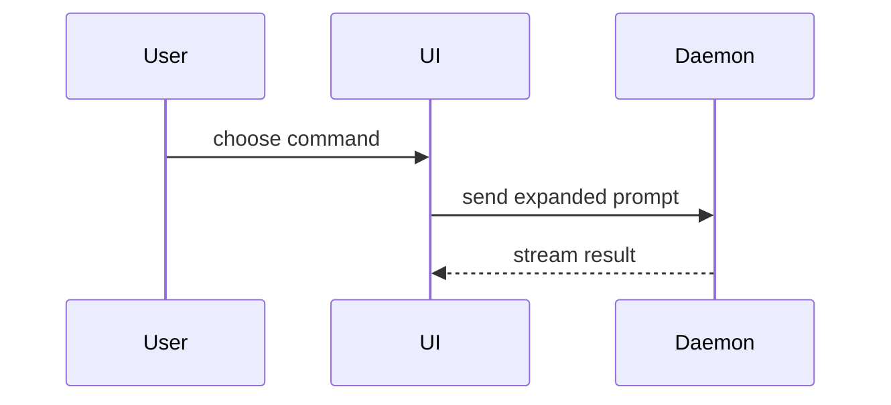

Help the user understand the current topic visually. Skip the preamble and keep prose brief. Pick the smallest view that makes the key point clear. Explain; do not write or propose implementation code.

When the explanation is technical, apply [asd-ste100](../asd-ste100/SKILL.md) (STE-flavored) to the prose.

- Show logic or an algorithm as pseudocode:

```text
on(save)
  if content is unchanged
    return cached result
  write new content
  return fresh result
```

- Show runtime control flow as a call tree:

```text
solve(prob)
  initialize
  step!
    rhs!
    jacobian!
  finalize
```

- Show plot layout as a hierarchy of `GridLayout`s, including nested layouts and what each cell owns:

```text
Figure
└── GridLayout (root)
    ├── fig[1, 1] Axis              # field heatmap
    ├── fig[1, 2] Colorbar
    └── fig[2, :] GridLayout        # summary row
        ├── [1, 1] Axis             # timeseries
        └── [1, 2] Axis             # histogram
```

- Show file responsibility or a broad refactor as a shallow file tree:

```text
src/
├── commands/       # parses user actions
├── sessions/       # owns session state
└── transport/      # sends API requests
```

- Show interaction, control flow, or data flow with Mermaid:



- Use `diff` when the point is what changes and the surrounding shape already exists. Match the diff shape to the topic.

For a layout change:

```diff
 Figure
 └── GridLayout (root)
     ├── fig[1, 1] Axis            # field heatmap
+    ├── fig[1, 2] Colorbar
     └── fig[2, :] GridLayout      # summary row
         ├── [1, 1] Axis           # timeseries
-        └── [1, 2] Axis           # residual
+        └── [1, 2] Axis           # histogram
```

For a file-layout change:

```diff
 src/
 ├── commands/
+│   └── expand_skill.jl   # expands the slash command
 ├── sessions/
-└── transport.jl
+└── transport/
+    ├── client.jl
+    └── stream.jl
```

For a call-tree or call-stack change:

```diff
 solve(prob)
   initialize
   step!
     rhs!
+    precondition!
     jacobian!
-  finalize
+  finalize
+    write_restart
```

For a state or control-flow change:

```diff
 on(save)
-  write content
+  if content is unchanged
+    return cached result
+  write new content
+  invalidate cache
```

- Show the whole sketch when most of it is new, or when omitted context would hide ownership or order.

### guidance

Place each visual next to the short text it supports. Keep only the calls, files, layouts, states, and boundaries needed to answer the user's current question or the options to resolve the current discussion point.

You may use one of these, you may use several, it is unlikely you will use all of them. Use your judgement and don't overwhelm the user.
